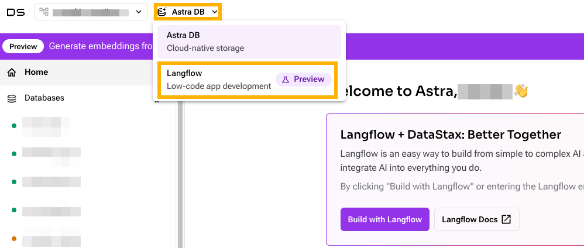

# Langflow Workshop

ローコード・ノーコードで生成 AI のアプリケーション開発を行うことができる Langflow の使い方を知るためのハンズオンコンテンツを提供しています。[DataStax Langflow](https://www.datastax.com/products/langflow) を利用することを想定していますが、[オープンソース版の Langflow](https://github.com/langflow-ai/langflow) でも環境を整えることで利用可能です。

DataStax Langflow を利用するためには DataStax のアカウントが必要です。アカウントは無料で作成することが可能です。また、生成 AI のアプリケーションを開発する際には Langflow 以外に、LLM (大規模言語モデル) などの生成 AI のモデルを利用するためのツールやサービスが必要になります。これらのサービスを利用するためのアカウント作成方法について[こちら](./account.md)にまとめています。

# 生成 AI アプリケーション

このワークショップでは以下の代表的な生成 AI アプリケーションを取り扱う予定です。

- LLM とのチャットボット: [basic_chatbot](./basic_chatbot/)

    ユーザが質問を入力すると LLM が持っている知識にもとづいて回答するチャットボット。

- RAG(検索拡張生成)  

    ユーザが質問を入力すると、指定されたデータベースの情報を検索し、検索結果にもとづいて回答するチャットボット。外部公開されていないデータべースにある情報も利用した回答を生成できます。

- Agentic AI  

    ユーザが複雑なタスク・ゴールを与えると、生成 AI モデルをそれを理解し、必要に応じてデータベースの検索、外部 API の実行といったツールを利用しながら、タスクを完了するエージェント。チャットボットや RAG などと異なり、生成 AI モデルは思考やツールの適用などを繰り返し行います。参考: [Practices for Governing Agentic AI Systems](https://openai.com/index/practices-for-governing-agentic-ai-systems/)

# Workshop の準備

1. [アカウント作成方法](./account.md) に従って、DataStax のアカウントとそれ以外の必要なアカウントを作成します。
2. DataStax の[コンソール](https://astra.datastax.com/)でサインインします。
3. Langflow の画面に移動します。画面上部のメニューから Langflow に移動できます。

4. Langflow の画面を開いてワークショップを行います。ワークショップのコンテンツは次の節にまとめています。

# Workshop のコンテンツ

