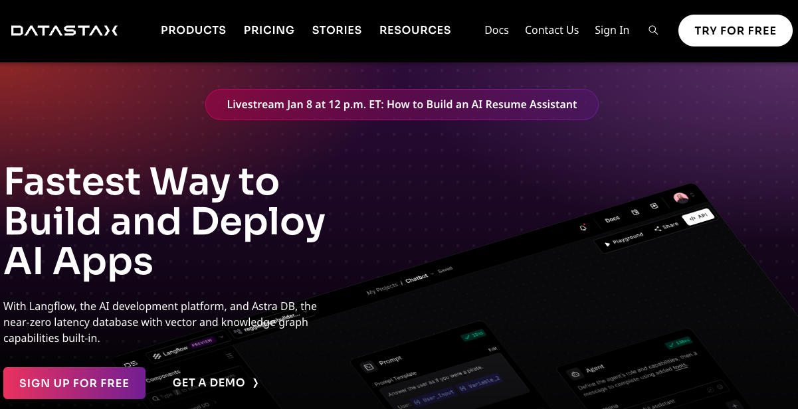
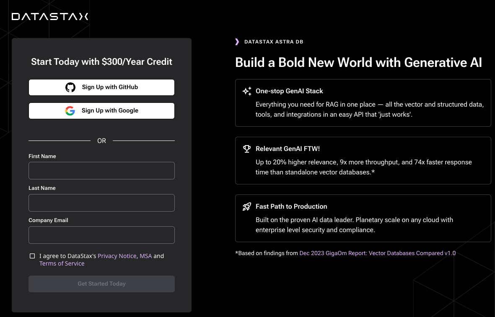
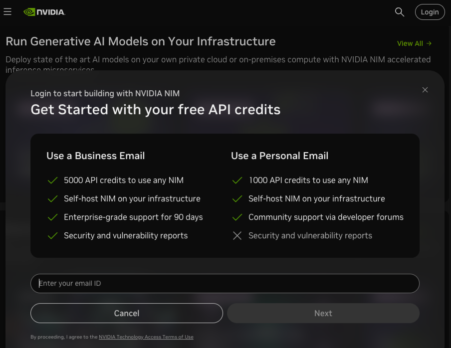
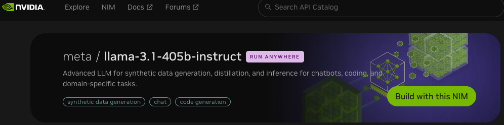
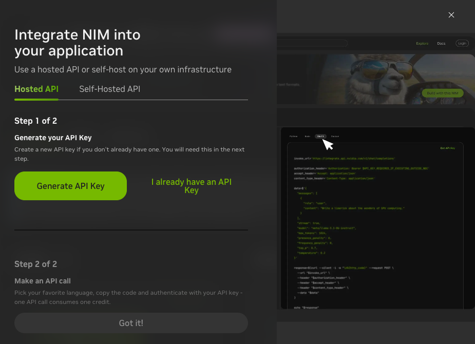

# アカウント作成方法

Langflow Workshop を行う際に利用する各種サービスのアカウント作成方法をまとめました。DataStax Langflow を使うためには DataStax のアカウントが必要ですが、それ以外のアカウントはコンテンツによって必要な場合と不要な場合がありますので、
このページの内容や画面キャプチャは最新ではない可能性がありますので、最新情報は各サービスのウェブページで確認してください。

## DataStax 

DataStax の Langflow や生成 AI のためのデータを保存する Astra DB を利用する場合は DataStax のアカウントが必要です。[DataStax のウェブサイト](https://www.datastax.com/)にアクセスしてアカウントを作成します。

画面中央の SIGN UP FOR FREE や 右上の TRY FOR FREE をクリックしてアカウント作成画面に移動します。左側に必要事項を記入するフォームが現れます。入力を完了すると、指定したメールアドレスに、メールアドレスが正しいかどうかを確認するメールが届きます。期限が決まっているので、期限内にクリックすると登録は完了です。利用できる量やリージョンなどに制限があったりしますが無料で使えます（クレジットカード登録不要）。

## NVIDIA

NVIDIA NIM で利用できる LLM を API 経由で利用するためには、NVIDIA Cloud Account が必要です。
まずNVIDIA のウェブサイトから NVIDIA Account を作成して、次に NVIDIA Cloud Account を作成します。

まず以下のページから NVIDIA Account を作成します。メールに認証コードが届くのうで入力して完了します。    
https://ngc.nvidia.com/signin

次に NVIDIA Cloud Account を作成します。この後、NVIDIA の提供する LLM を API 経由で利用するので、LLM へアクセスする以下のページから NVIDIA Cloud Account を作成しましょう。画面右上の Login をクリックして開く以下の画面に、NVIDIA Account のメールアドレスを入力します。　　
https://build.nvidia.com/explore/discover

NVIDIA Cloud Account を作成していない場合は、作成画面に移動します。NVIDIA Cloud Account に利用するユーザ名などを指定します。アカウント番号が個別に割り与えられます。作成が完了すると https://build.nvidia.com/explore/discover にログインすることができます。

### NVIDIA API Key の発行
https://build.nvidia.com/explore/discover には複数のモデルが掲載されていて、利用したいモデルを選択した後、Build with this NIM -> Generate API Key から API Key を発行することができます。

