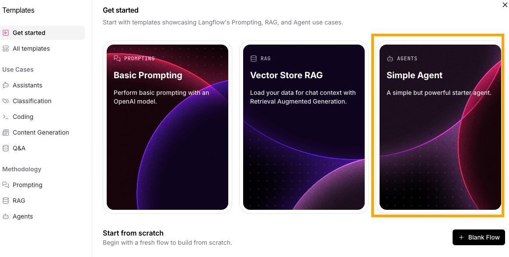
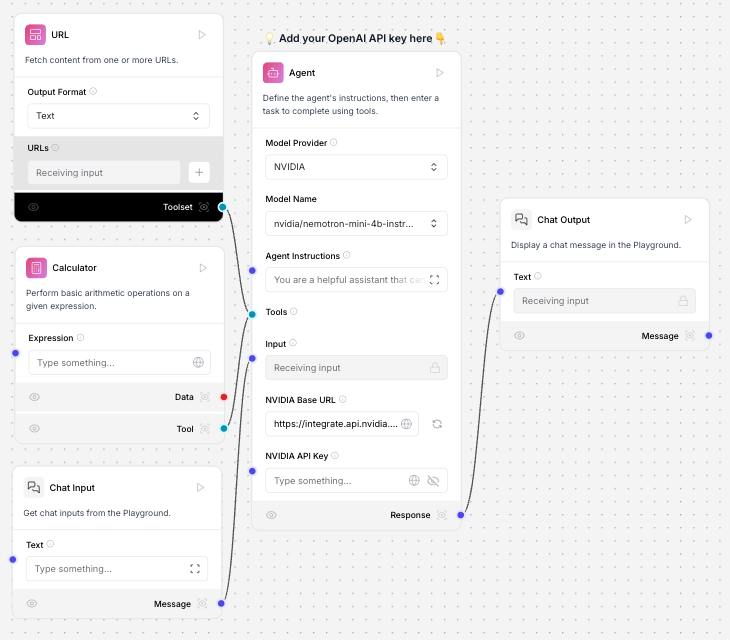
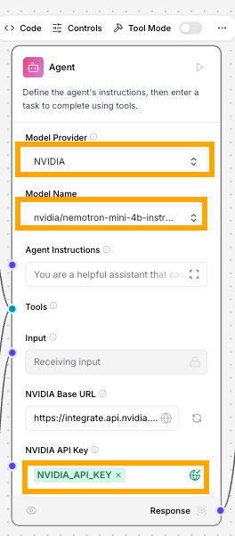

# LLM を使った AI エージェントの構築

## 概要

このワークショップでは、LLM (大規模言語モデル) を利用した AI エージェントの構築を行います。

<!-- チャットボットのコンポーネントは大きく4つあり、ユーザからの入力、LLM、LLM に対する指示 (プロンプト)、ユーザへの出力です。Langflow では、この4つのコンポーネントからなるテンプレートを提供しているので、このテンプレートを修正して利用します。LLM は NVIDIA で提供されているものを利用します。 -->

### 事前に準備するもの

- DataStax のアカウント
- NVIDIA の LLM にアクセスするための API キー

## テンプレートを利用したフローの作成

[Workshopの準備](https://github.com/harusametime/langflow-workshop/blob/main/README.md#workshop-%E3%81%AE%E6%BA%96%E5%82%99) に従って、Langflow の画面を開きます。画面の右側に New Flow のボタンがあるのでクリックします。

ボタンをクリックするといくつかのテンプレートが表示されます。今回は LLM を使った AI エージェントのテンプレートとして、Simple Agent を選択します。

## AI エージェントフローの修正

### AI エージェントフローの全体像

### AI エージェントの修正

## Playground を使った AI エージェントのテスト