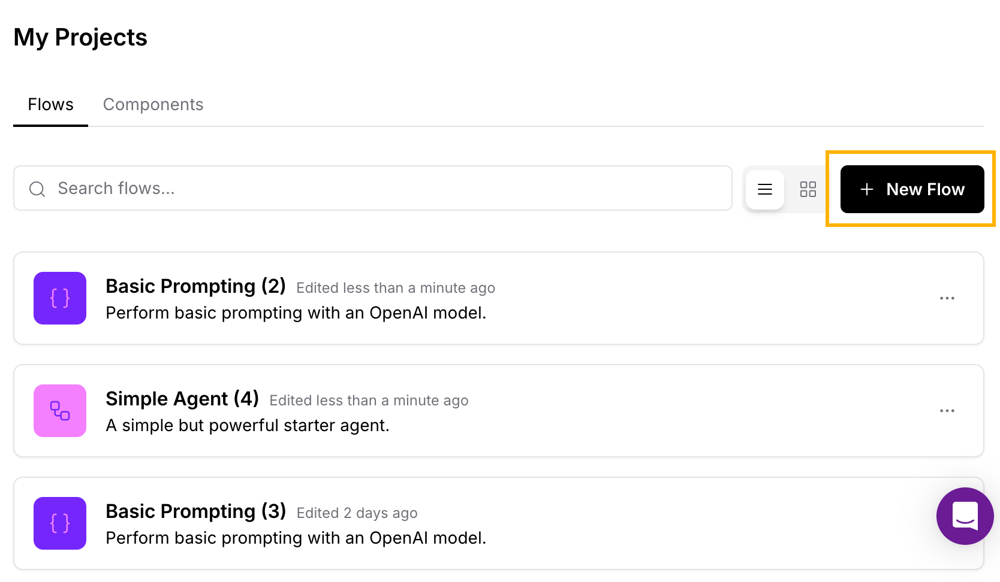
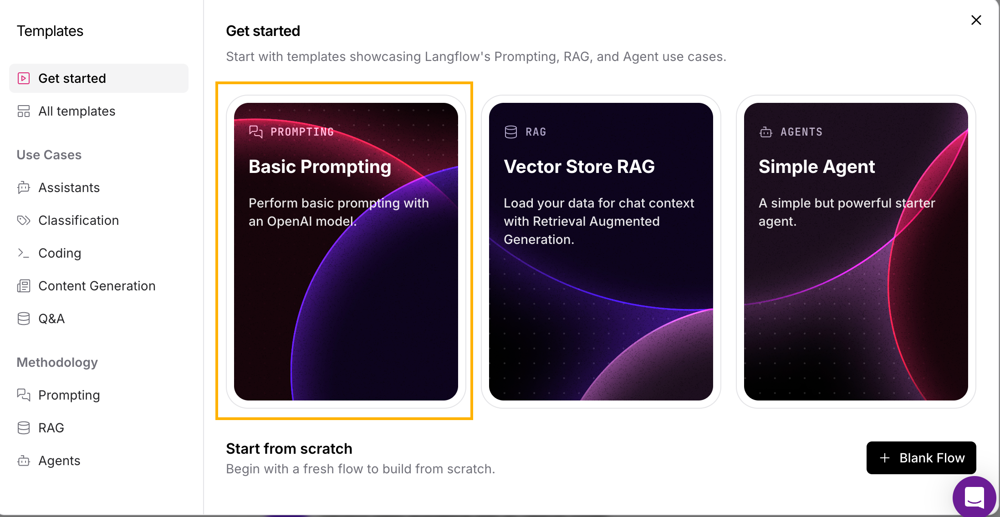
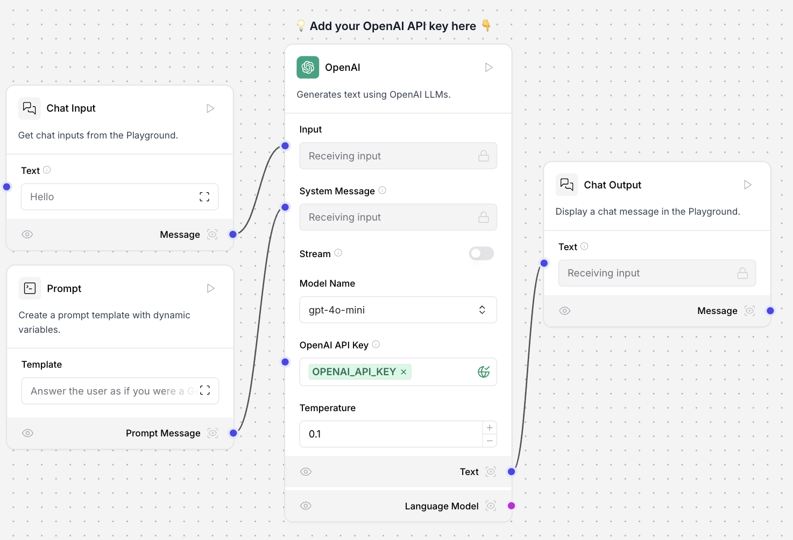
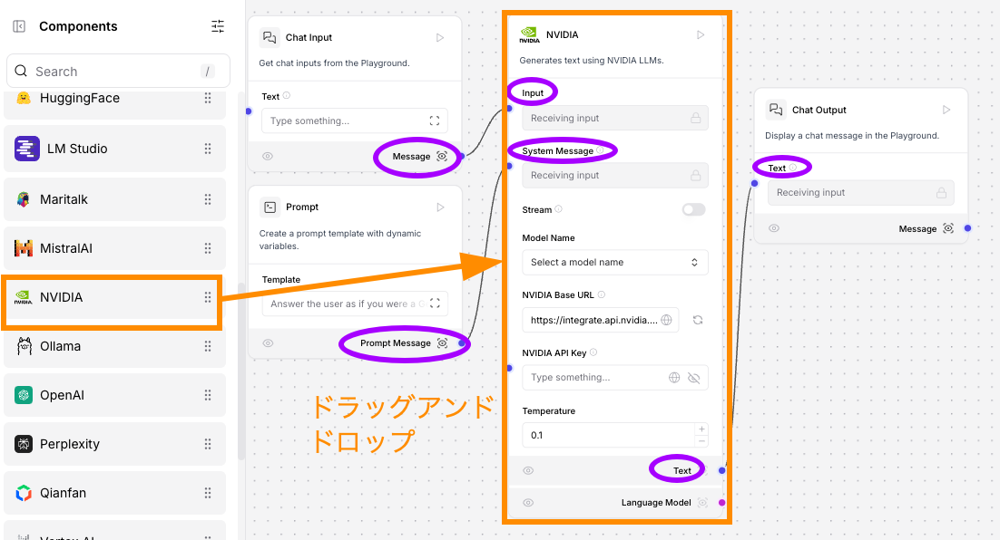
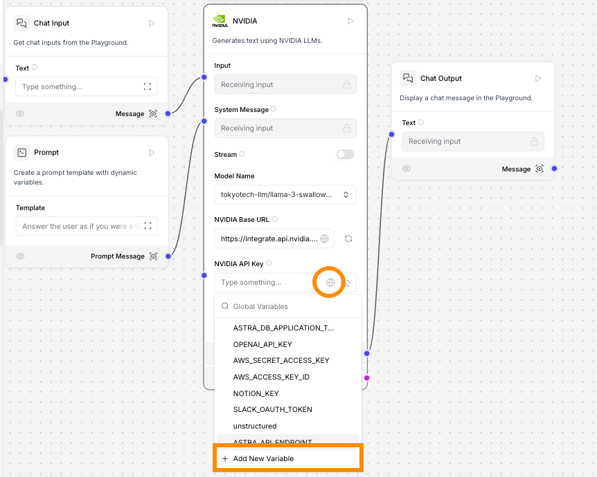
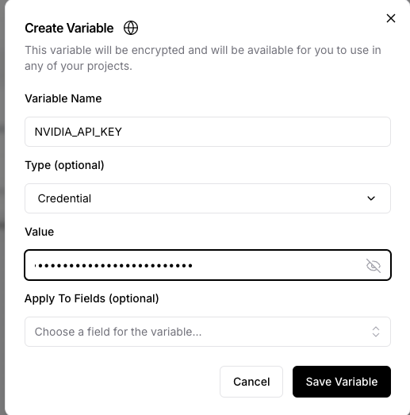
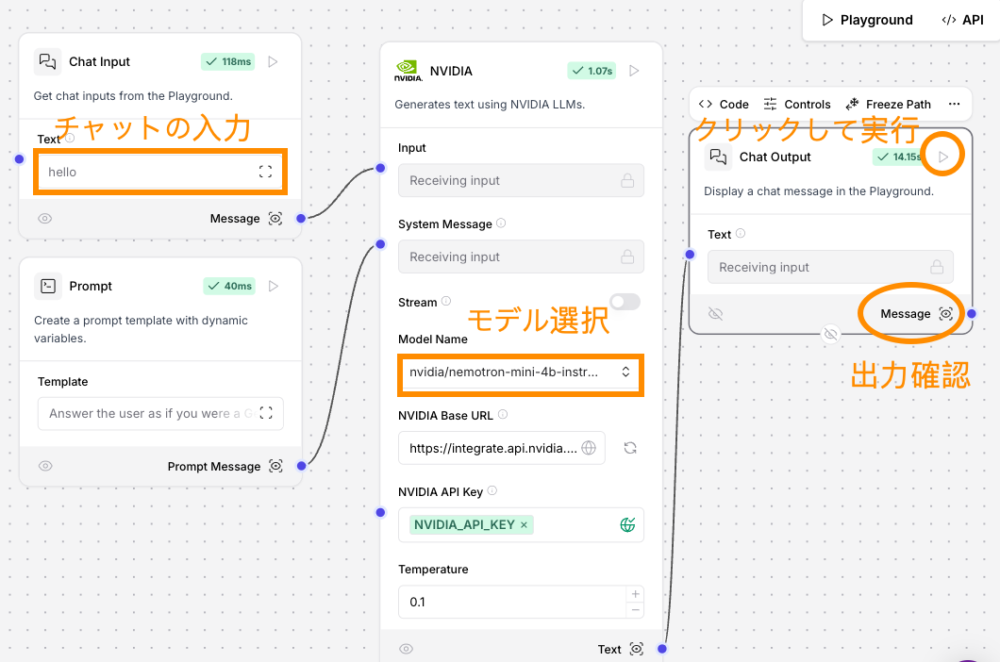
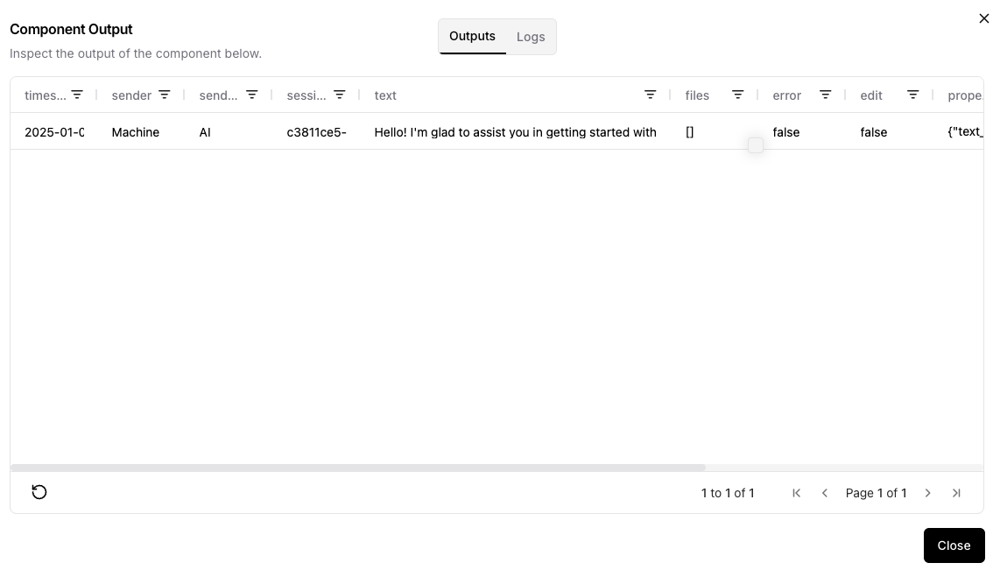
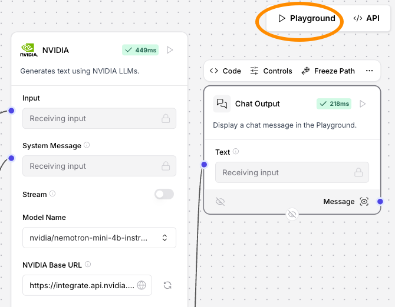
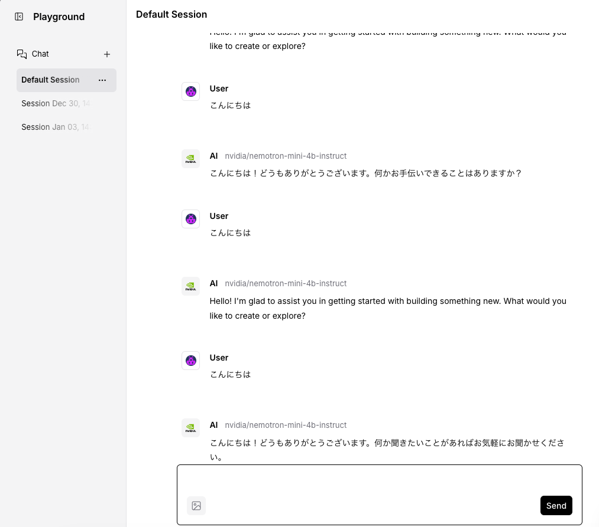

# LLM を使ったチャットボットの構築

## 概要

このワークショップでは、LLM (大規模言語モデル) を利用したチャットボットの構築を行います。チャットボットのコンポーネントは大きく4つあり、ユーザからの入力、LLM、LLM に対する指示 (プロンプト)、ユーザへの出力です。Langflow では、この4つのコンポーネントからなるテンプレートを提供しているので、このテンプレートを修正して利用します。LLM は NVIDIA で提供されているものを利用します。

### 事前に準備するもの

- DataStax のアカウント
- NVIDIA の LLM にアクセスするための API キー

## テンプレートを利用したフローの作成

[Workshopの準備](https://github.com/harusametime/langflow-workshop/blob/main/README.md#workshop-%E3%81%AE%E6%BA%96%E5%82%99) に従って、Langflow の画面を開きます。画面の右側に New Flow のボタンがあるのでクリックします。

ボタンをクリックするといくつかのテンプレートが表示されます。今回は LLM を使ったチャットボットのテンプレートとして、Basic Prompting を選択します。

Basic Prompting のテンプレートのフローが表示されます。ユーザからの入力、LLM、LLM に対する指示 (プロンプト)、ユーザへの出力の4つのコンポーネントで構成されています。

もし OpenAI の API Key を持っていれば、　OpenAI API Key の入力フォーム右側にある丸いアイコンをクリックして、`Add New Variable`から OpenAI API Key を登録すれば利用可能です。

## テンプレートのカスタマイズ

### NVIDIA コンポーネントの配置と接続

ここでは、上記のテンプレートにおける OpanAI のモデルを NVIDIA が提供するモデルに変更してみます。左のメニューから`Models`のカテゴリを選択し、`NVIDIA`を右のワークスペースにドラッグアンドドロップします。もともと配置されていた OpenAI のコンポーネントは削除します。それ以外のコンポーネントと以下のように接続します。
- Chat Input の Message を NVIDIA の Input に
- Prompt の Prompt Message を NVIDIA の System Message に
- NVIDIA の Text を Chat Output の Text に

### NVIDIA API Key の設定

NVIDIA のモデルを利用するためには NVIDIA API Key を発行してコンポーネントに設定する必要があります。API Key の発行方法は[[こちら](https://github.com/harusametime/langflow-workshop/blob/main/account.md#nvidia-api-key-%E3%81%AE%E7%99%BA%E8%A1%8C)]を確認してください。

API Key を発行したら、コンポーネントの`NVIDIA API KEY`にある右側のアイコンをクリックして、Add New Variable を選択します。

Create Variable の画面が出てくるので
- Variable Name に任意の名前を設定します
- Type から Credential を選択します（そうすると Value の値を隠すことができます
- Value には発行した API Key を入力します

## チャットボットのテスト

NVIDIA のコンポーネントで`Model Name`を選択します (以下の図では `nvidia/nemotron-mini-4b-instruct`を選択しています。)。Chat Input の Text に質問をいれて、Chat Output の再生ボタン(▷)をクリックすると、
Prompt の Template に従って、選択したモデルが回答を生成します。

出力は Chat Output の Message を開くと text の列で確認することができます。例えば、「こんにちは」と入れたとき "Hello! I'm glad to assist you in getting started with building something new. What would you like to create or explore?"が出力されました。

### プロンプトの修正

Prompt のコンポーネントの Template を開いて修正して、「こんにちは」に対して日本語で回答してくれるように指示してみましょう。デフォルトの template は "Answer the user as if you were a GenAI expert, enthusiastic about helping them get started building something fresh." なので、英語で指示していますが、日本語で指示してみます。例えば「ユーザーからの質問に対して日本語で回答してください。」としてみましょう。先程のテストと同様に、Chat Outputの再生ボタンをクリックするとフローが実行され出力を得ることができます。

### Playground を利用したテスト

