# LLM を使った RAG チャットボットの構築

## 概要

このワークショップでは、LLM (大規模言語モデル) とベクトルデータベースを利用して RAG (検索拡張生成; Retrieval Augmented Generation) のチャットボットの構築を行います。LLM は NVIDIA NIM、ベクトルデータベースは DataStax Astra Vector DB を利用します。

RAG は、生成 AI による回答の精度を向上させる一つの手段です。具体的には、ユーザーのクエリに対して関連するデータを検索し、そのデータを元にAIが回答を生成します。これにより、AIが最新の情報を利用して回答を生成するため、誤った情報を提供するリスクが減少します。

### 事前に準備するもの

- DataStax のアカウント
- NVIDIA の LLM にアクセスするための API キー

## テンプレートを利用したフローの作成

[Workshopの準備](https://github.com/harusametime/langflow-workshop/blob/main/README.md#workshop-%E3%81%AE%E6%BA%96%E5%82%99) に従って、Langflow の画面を開きます。画面の右側に New Flow のボタンがあるのでクリックします。

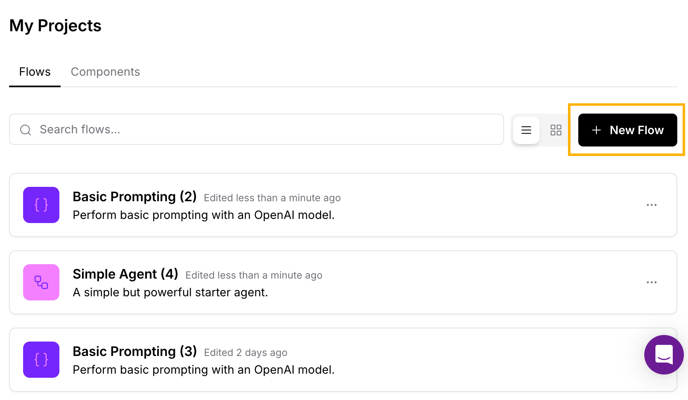

ボタンをクリックするといくつかのテンプレートが表示されます。今回は LLM を使った RAG チャットボットのテンプレートとして、Vector Store RAG を選択します。

RAG チャットボットのテンプレートのフローが表示されます。チャットボットのフローは以下の2つのフローで構成されます。
- 関連するデータをあらかじめベクトルデータベースに保存するフロー
- ベクトルデータベースから検索して LLM で回答を生成するフロー

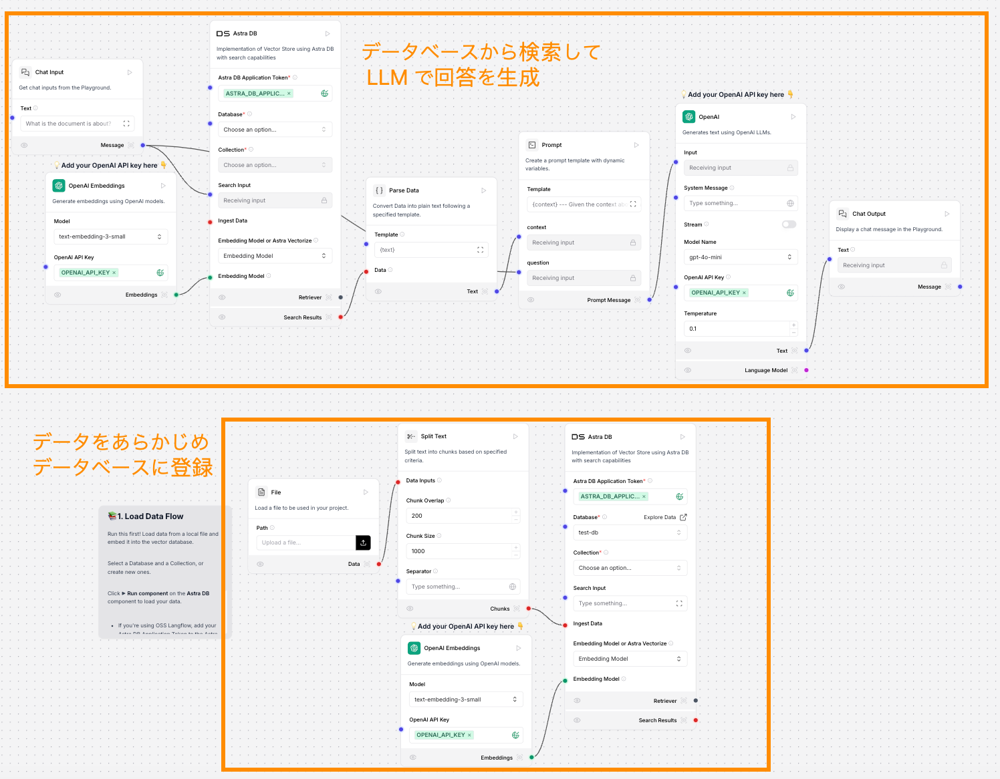

それぞれのフローの設定について以下で説明します。

## データをあらかじめデータベースに登録

まずは2つのフローのうち下部にあるデータをあらかじめベクトルデータベースに保存するフローを設定します。このフローはデータベースに投入するファイルをアップロードする File、それを分割する Split Text、投入先のデータベースである Astra DB とベクトル化に必要なEmbeddiings Model として OpenAI Embeddings のコンポーネントから構成されます。

ここではデータを投入するベクトルデータベースが必要なので、Astra Vector DB を作成し、そこにデータを投入します。データを投入する際はテキストからベクトルという数百以上の数値データに変換するため、NVIDIA の埋め込みモデルを使用します。

### Langflow から Astra Vector DB を作成

まず Langflow の Astra DB コンポーネントから Vector DB を作成します。以下の図のように、Database から Add New Database を選んでデータベースを作成することができます。Langflow からだけでなく、DataStax の [Astra DB コンソール](https://astra.datastax.com/)からも作成することは可能です。

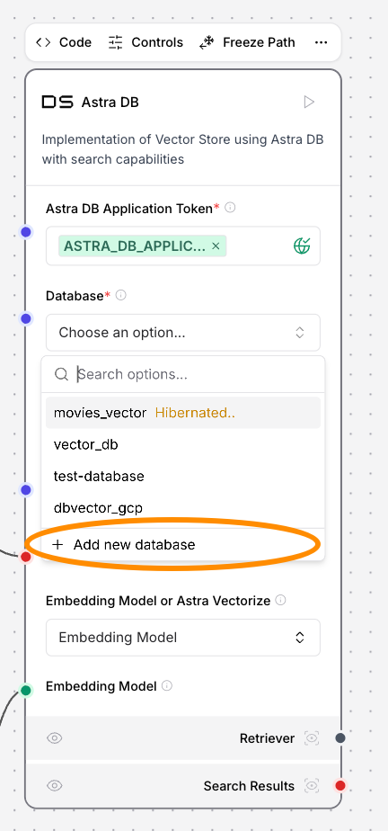

Add New Database を選ぶと必要事項を記入する画面が出てくるので、データベース名とデプロイ先のクラウドプロバイダ、リージョンを選択します。

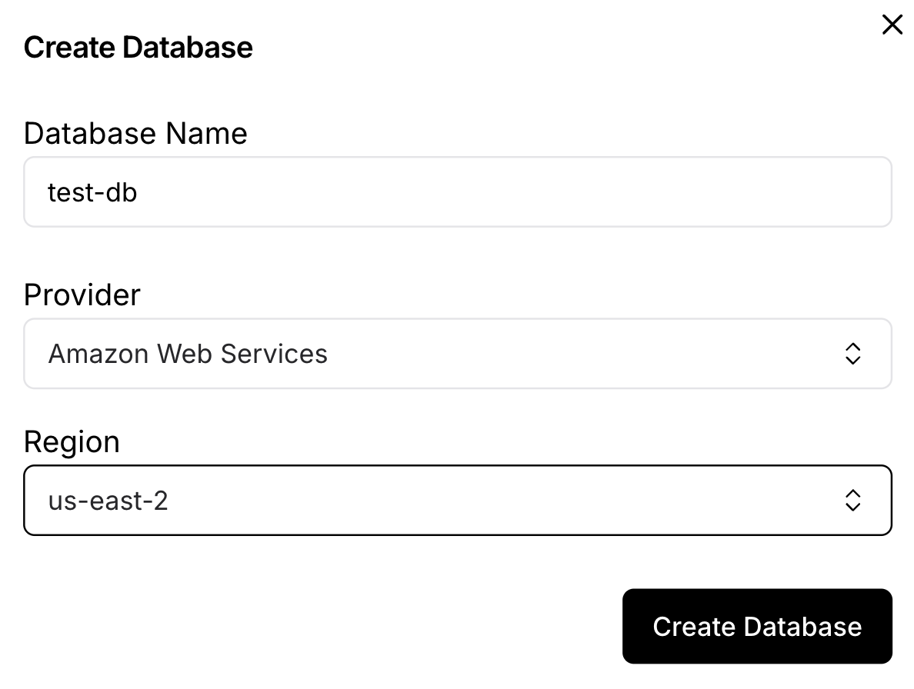

データベースが作成されたら、次に collection を作成します。Collection はベクトルデータベースのテーブルで、実際にベクトルを格納します。データベースは複数の collection で構成されます。Collection を作成するときは次元数 (Dimensions) を指定する必要があり、利用する Embeddings Model の仕様に合わせる必要があります。今回は多言語に対応した baai/bge-m3 を後ほど選択しますので、このモデルが 1024 次元のベクトルを出力する仕様のため、ここでは 1024 と指定します。

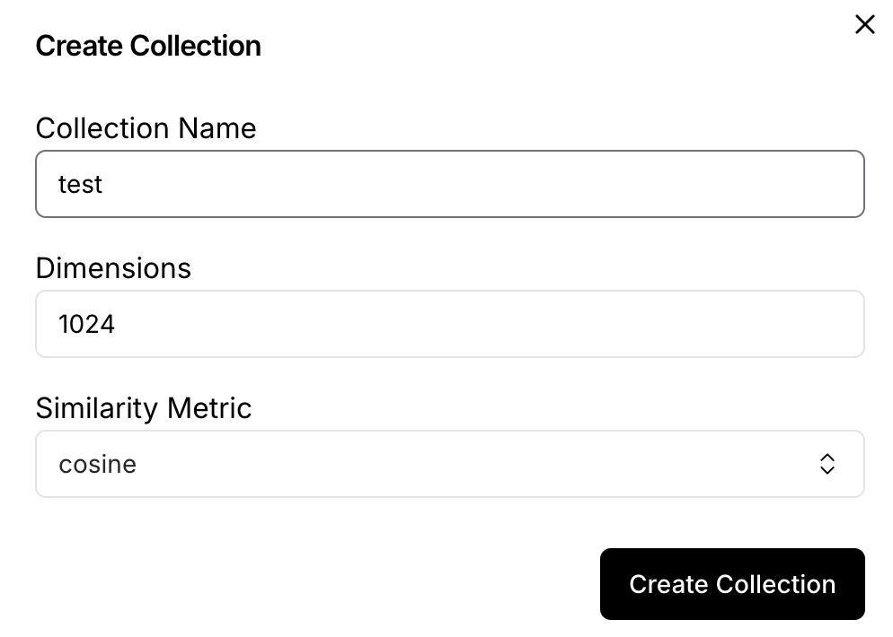

### Astra DB Application Token の取得と設定

作成したデータベースにアクセスするための Astra DB Application Token を取得して、Langflow のコンポーネントに設定します。Astra DB Application Token は [Astra DB コンソール](https://astra.datastax.com/) から取得します。

左側のメニューで先程作成したデータベース名を選択し、右側の Application Tokens の Generate Token ボタンをクリックすることで Token を表示することができます。Token は伏せ字ですが、右側のアイコンで表示したりコピーしたりすることが可能です。

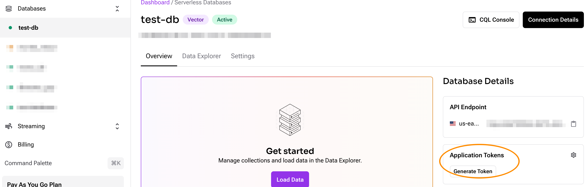

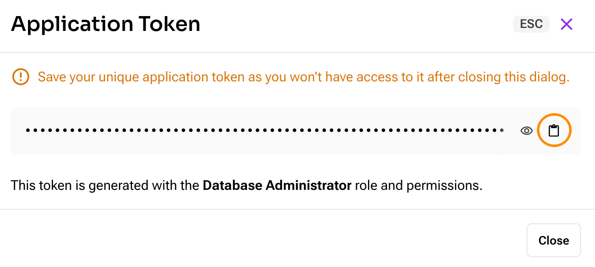

コピーが完了したら Astra DB コンポーネントの Astra DB Application Token から Add New Variable を選択して Application Token を作成して登録します。

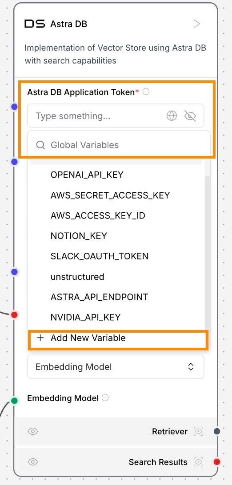

### ファイルのアップロード

File のコンポーネントからローカルにあるファイルをアップロードすることができます。ここでは以下の PDF をダウンロードして試してみます。

経済産業省「生成 AI 時代の DX 推進に必要な人材・スキルの考え方 2024～変革のための生成 AI への向き合い方～」, https://www.meti.go.jp/shingikai/mono_info_service/digital_jinzai/pdf/20240628_2.pdf

ダウンロードしたら File コンポーネントの Path からファイルのパスを指定してアップロードします。

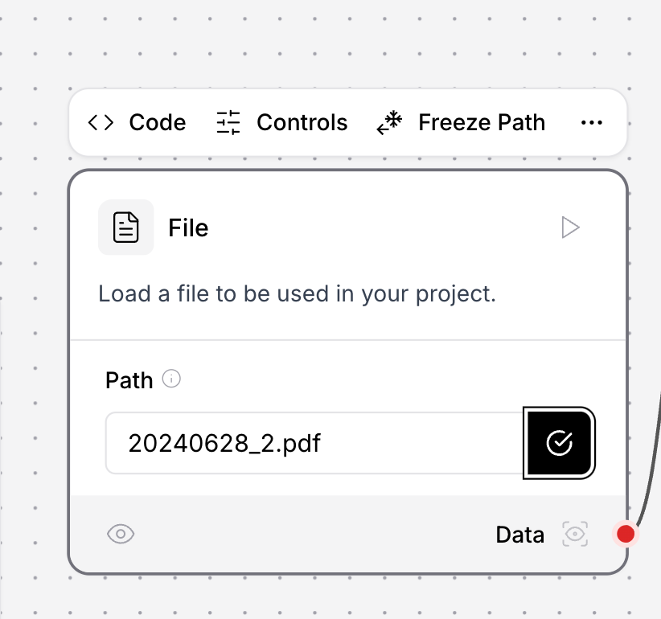

### Embeddings Model の変更

OpenAI Embeddings がデフォルトで指定されていますが、ここでは NVIDIA NIM で提供されている baai/bge-m3 を利用します。以下の図に示すように Model から選びます。

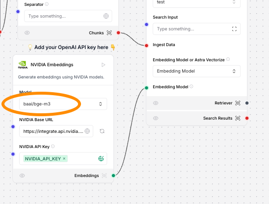

### データ投入と確認
Astra DB のコンポーネント右上にある再生ボタン (▷) をクリックすることでデータ投入のフローが実行されます。
[Astra DB のコンソール](https://astra.datastax.com/) に移動して、先程作成したデータベース、collection を選択するとアップロードされた PDF のテキストとベクトル情報が追加されていることがわかります。

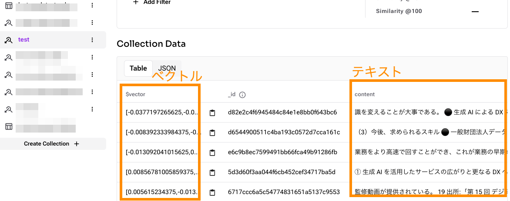

## ベクトルデータベースから検索して LLM で回答を生成

次に上部のフローである検索と LLM で回答を生成するフローを設定します。このフローは左から順に、チャットの入力、入力をベクトル化するOpenAI Embeddings、ベクトル化された入力を検索する Astra DB、検索されたデータをテキスト化する Parse Data、テキストをプロンプトに組み込む Prompt、プロンプトに基づいて回答を生成する OpenAI、チャットの出力となっています。ここでは以下のコンポーネントを変更します。

1. OpenAI Embeddings を NVIDIA のコンポーネントに置き換え、データベースへデータを追加する際と同じモデル (baai/bge-m3) を指定する
1. Astra DB に、データを追加した先のデータベース名、コレクション名を指定する
1. OpenAI は NVIDIA の LLM に変更する

1.と2.に関しては、データをデータベースに追加したときと同じ設定を利用します。データベースの作成は不要です。設定は上記の [Langflow から Astra Vector DB を作成](https://github.com/harusametime/langflow-workshop/blob/main/rag_chatbot/nvidia_rag.md#langflow-%E3%81%8B%E3%82%89-astra-vector-db-%E3%82%92%E4%BD%9C%E6%88%90)や[Embeddings Model の変更](https://github.com/harusametime/langflow-workshop/blob/main/rag_chatbot/nvidia_rag.md#embeddings-model-%E3%81%AE%E5%A4%89%E6%9B%B4)を参照してください。

### OpenAI のコンポーネントを NVIDIA に変更する
左のメニューの **Models から NVIDIA のコンポーネント** を選んで右のスペースにドラッグアンドドロップします (**Embeddings にある NVIDIA Embeddings ではありません**)。
OpenAI のコンポーネントを下図のように NVIDIA で置き換えます。Model Name は `nvidia/nemotron-mini-4b-instruct` を選びます。NVIDIA API Key は、NVIDIA Emebddings に合わせて、すでに設定されている可能性もあります。もし設定されていなければ設定します。

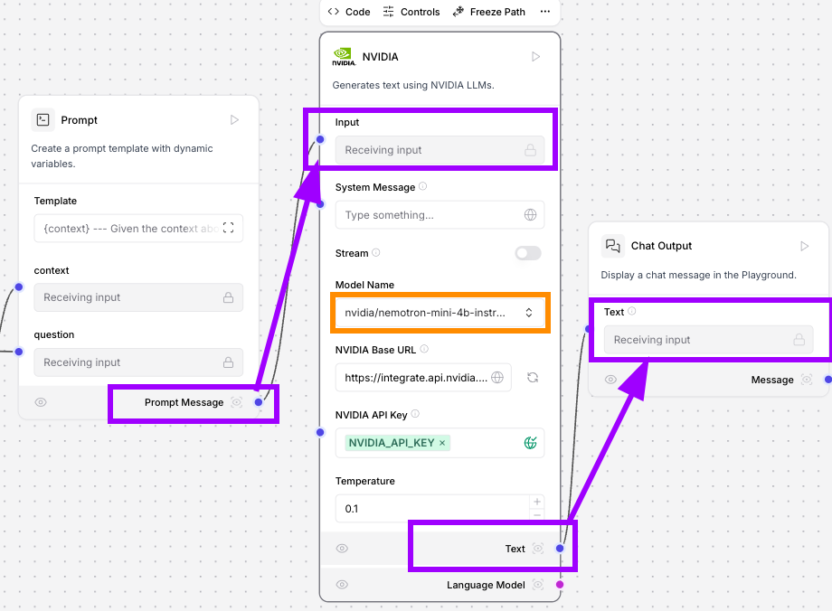

## Playground からテスト
画面右上にある Playground からテストしてみます。
今回アップロードした PDF の内容に関する質問をしてみましょう。例えば「知的労働者の生成 AI の業務利用割合について日本語で教えて下さい」と聞いてみましょう。
PDF の p.7 にある文章を使って回答を生成することができています。

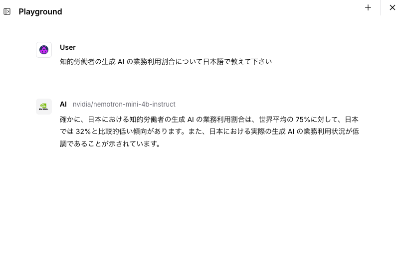

