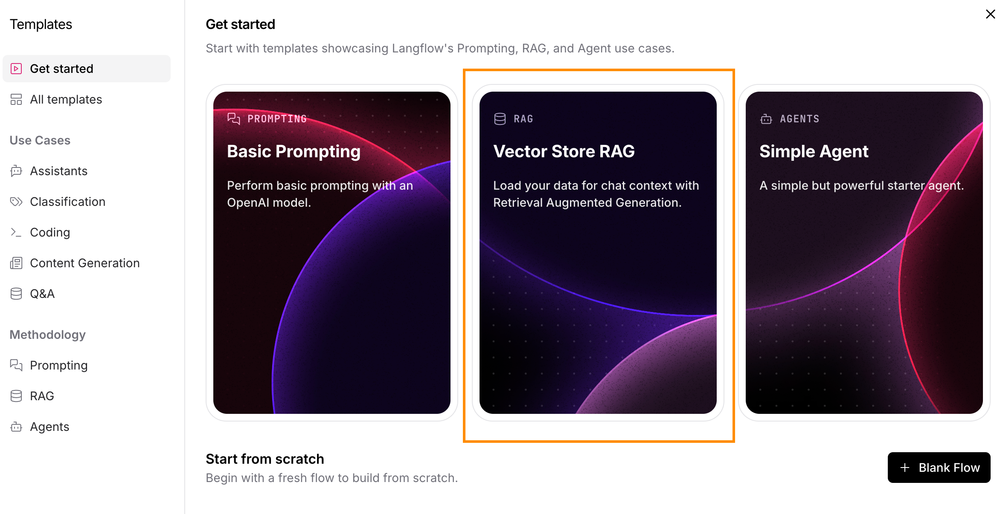

# LLM を使った RAG チャットボットの構築

## 概要

このワークショップでは、LLM (大規模言語モデル) とベクトルデータベースを利用して RAG (検索拡張生成; Retrieval Augmented Generation) のチャットボットの構築を行います。LLM は NVIDIA NIM、ベクトルデータベースは DataStax Astra Vector DB を利用します。

RAG は、生成 AI による回答の精度を向上させる一つの手段です。具体的には、ユーザーのクエリに対して関連するデータを検索し、そのデータを元にAIが回答を生成します。これにより、AIが最新の情報を利用して回答を生成するため、誤った情報を提供するリスクが減少します。

チャットボットのフローは以下の2つのフローで構成されます。
- 関連するデータをあらかじめベクトルデータベースに保存するフロー
- ベクトルデータベースから検索して LLM で回答を生成するフロー

### 事前に準備するもの

